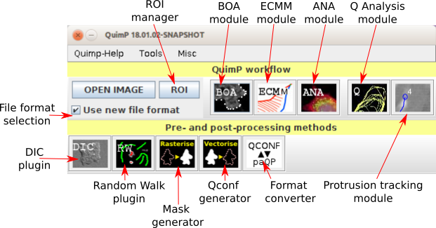
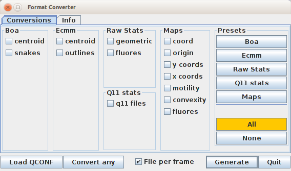
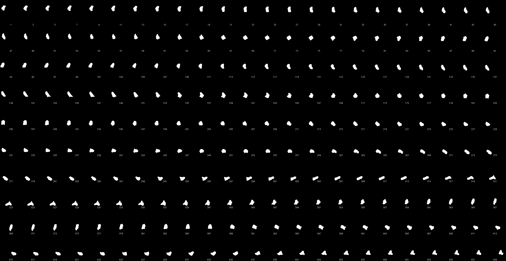

# quimp2numpy

This document gives some clues about converting QuimP datafiles to format easily accessible from Python.

## The workflow

### Segmentation

1. Open the image and run **BOA** from QuimP bar.
2. Segment your data. One might want to read [1] and [2]
3. Quit BOA saving your data (*Save&Quit* button). The *QCONF* file will be produced.
4. Proceed to next steps of the workflow if you need them. BOA plugin segments the image and produces vector contours what might be enough for comparing segmentations.

### Conversion to text format

#### Manual approach

1. From **QuimP bar** open Format Converter (FC)

   

2. Click *Convert any* button and load *QCONF* file produced by BOA. Conversion process will start - **Wait** - there is no progress bar and large files can take a while. Converted files are saved in the same folder the *QCONF* was loaded from.

   

   1. Depending on the QuimP workflow steps run on this particular *QCONF* file (**BOA**, **ECMM**, **ANA**, **Q-Analysis**) you will get some or all of the files explained in [5].
   2. **The most relevant for exchanging contours between frameworks might be *snQP* files**. They contain coordinates of nodes for each frame (all frames are in one file for one cell, if there is more cells tracked, each will be saved in separate file.).

#### Macro approach

One can encompass above steps in macro that can be run from Fiji. To create and run macro go to Fiji and call `Plugins/Macros/New/Macro` to open Macro Editor. Paste to following code (modify path to *QCONF* first) and click *Run macro*

```java
// Use slash as path separator on Windows as well.
run("Format converter", "opts={status:[],areMultipleFiles:true,paramFile:(C:/Users/baniu/Documents/test/160617-Lifeact-mRFP-3.QCONF)}");
```

Another option `Plugins/Macros/Run` allows to run macro from disk.

#### Running macro from command line

Macros can be run directly from command line, what makes this feature usefull for massive processing. Assume that:

- above macro is saved as *test.ijm* file (extension is important here, otherwise ImageJ can fail)
- Fiji is installed and QuimP plugin is available (see [6] for installation details).

To run it directly from command line execute:

```bash
# The Fiji executable is different for Linux/Mac
C:\Users\baniu\Apps\Fiji.app\ImageJ-win64.exe --console -macro .\test\test.ijm
```

Preferable there should be flag `--headless`` used to prevent ImageJ window to pop out but it crashes the program. This is apparently a bug in FormatConverter, which I already.

##### Even more sophisticated macro

Macros can accept external parameters. Modify the first macro to the form as below:

```java
//#@File(label="Select a QCONF file", persist=false) path
// Line above is NOT a comment
path = replace(path, "\\", "/"); // to del with Windows path separator
run("Format converter", "opts={status:[],areMultipleFiles:true,paramFile:(" + path + ")}");
```

Now if you run this macro from Macro Editor, you should get file selector to pick *QCONF* file. This mechanism allows providing parameters also from command line thus macro can stay unmodified all the time.

**Example below does not work due to bug mentioned earlier. I include it hoping that the bug can be fixed easily in near future.**

```bash
# The Fiji executable is different for Linux/Mac
# the 'path' keyword is the same keyword as in the line #@File in macro
C:\Users\baniu\Apps\Fiji.app\ImageJ-win64.exe --console -macro .\test\test.ijm 'path="C:/Users/baniu/Documents/test/160617-Lifeact-mRFP-3.QCONF"'
```

### Macros more generally

All Fiji plugins and most of QuimP modules can be called from macro. To discover syntax go to Fiji `Plugins/Macros/Record` and open macro recorder. Then run plugin you want to convert to macro **from menu but not from QuimP bar**, e.g. go to `Plugins/QuimP-19.01.01/Format Converter` to open FC, then load **QCONF** file and select desired outputs (e.g. maps if full pipeline was run on this file - this will extract all maps from **QCONF** and save them in *csv*). You should see in Macro Recorder something similar:

```java
run("Format converter", "opts={status:[map:coord,map:origin,map:ycoords,map:xcoords,map:motility,map:convexity,map:fluores],areMultipleFiles:true,paramFile:(C:\\Users\\baniu\\Documents\\test\\160617-Lifeact-mRFP-3.QCONF)}");
```

This is full command that if run as macro will end with the same results as it did now (backslashes need to be replaced by slashes). Example of full analysis carried by macro can be found in [1] and [numpy2paqp tutorial](../numpy2paqp/workflow.md).

## Generating binary images from contours and vice versa

QuimP can rasterize contours and produce binary maps from them. For this purpose use *Mask generator* tool from QuimP toolbar (or `Plugins/QuimP-19.01.01/Generate Mask` from menu). Reverse operation - generation contours from binary masks is also possible by *QconF generator* tool (`Plugins/QuimP-19.01.01/Generate Qconf`).

1. Both tools support multislice tiffs.
2. The *QconF generator* requires that objects on the adjacent frames overlap.
3. Both tools should work from macro.

### Example

Contour009 rasterised (every 2nd frame):



```java
run("Generate mask", "opts={binary:true,paramFile:(C:/Users/baniu/Documents/test/160617-Lifeact-mRFP-3.QCONF)}");
run("Make Montage...", "columns=23 rows=10 scale=0.50 label");
saveAs("PNG", "C:/Users/baniu/Documents/Repos/moving_shapes/quimp2numpy/assets/Montage.png")
```

### Links

1. https://pilip.lnx.warwick.ac.uk/docs/master/QuimP_Guide.html#x1-100001 - exemplary walkthrough
2. https://pilip.lnx.warwick.ac.uk/docs/master/QuimP_Guide.html#x1-370005 - description of the architecture of maps generated by QuimP.
3. https://pilip.lnx.warwick.ac.uk/docs/master/QuimP_Guide.html#x1-120007 - about BOA
4. https://pilip.lnx.warwick.ac.uk/docs/Walkthrough.html - Matlab analysis of QuimP files (relates to old file format). This tutorial can be useful if you want to track point through the map.
5. https://pilip.lnx.warwick.ac.uk/docs/master/QuimP_Guide.html#x1-3100014 - datafiles explained
6. https://warwick.ac.uk/fac/sci/dcs/people/till_bretschneider/quimp/wiki-pages/installation/ - installation
